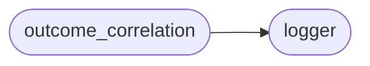

# Gat Outcome Correlation

[_Documentation generated by Documatic_](https://www.documatic.com)

<!---Documatic-section-Codebase Structure-start--->
## Codebase Structure

<!---Documatic-block-system_architecture-start--->

<!---Documatic-block-system_architecture-end--->

# #
<!---Documatic-section-Codebase Structure-end--->

<!---Documatic-section-gat.outcome_correlation.prepare_folder-start--->
## gat.outcome_correlation.prepare_folder

<!---Documatic-section-prepare_folder-start--->
<!---Documatic-block-gat.outcome_correlation.prepare_folder-start--->
<details>
	<summary><code>gat.outcome_correlation.prepare_folder</code> code snippet</summary>

```python
def prepare_folder(name, model):
    model_dir = f'models/{name}'
    if os.path.exists(model_dir):
        shutil.rmtree(model_dir)
    os.makedirs(model_dir)
    with open(f'{model_dir}/metadata', 'w') as f:
        f.write(f'# of params: {sum((p.numel() for p in model.parameters()))}\n')
    return model_dir
```
</details>
<!---Documatic-block-gat.outcome_correlation.prepare_folder-end--->
<!---Documatic-section-prepare_folder-end--->

# #
<!---Documatic-section-gat.outcome_correlation.prepare_folder-end--->

[_Documentation generated by Documatic_](https://www.documatic.com)